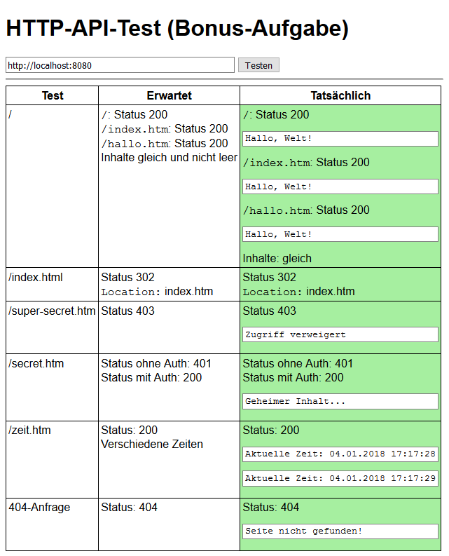

# HTTP-API-Test-Utility

Dieses Utility dient zum Testen einer Implementierung der
[Bonusaufgabe (HTTP-Basics mit Symfony)](https://zieris.net/webdev/aufgaben/bonus/http-symfony).

## Anleitung

```sh
$ git clone https://github.com/fzieris/php-http-api-test
$ cd php-http-api-test
$ composer install
$ php -S 127.0.0.1:8081
```

Dann im Webbrowser http://127.0.0.1:8081 aufrufen, die URL der prüfenden Installation eingeben
und auf *Testen* klicken.
Erfolgreiche Testfälle werden grün angezeigt.


